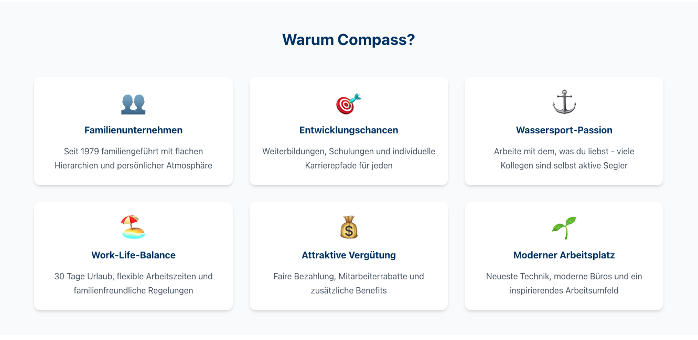
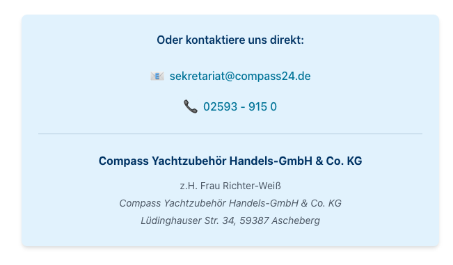
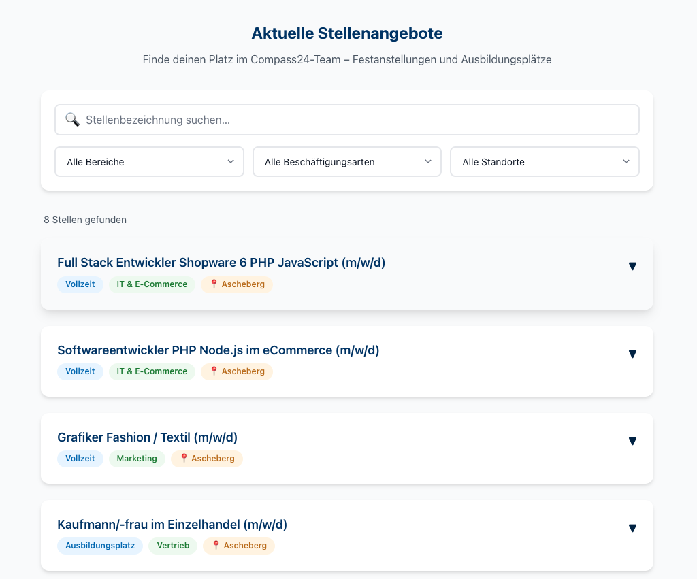
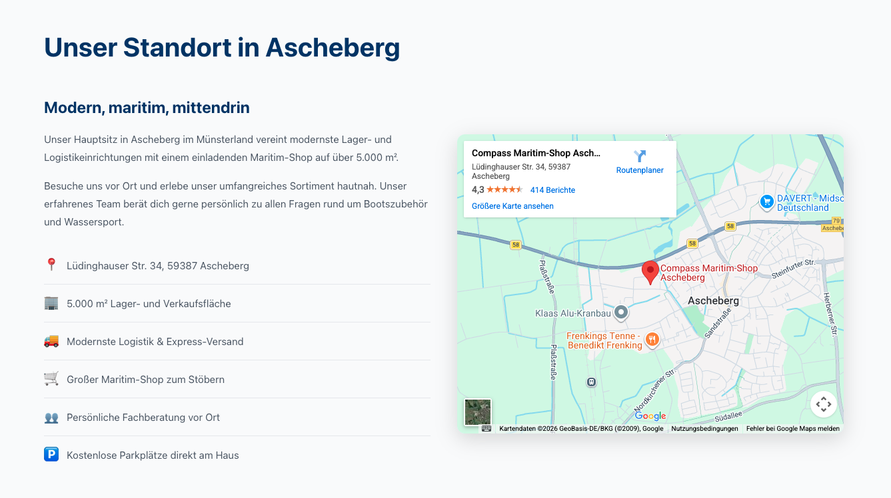
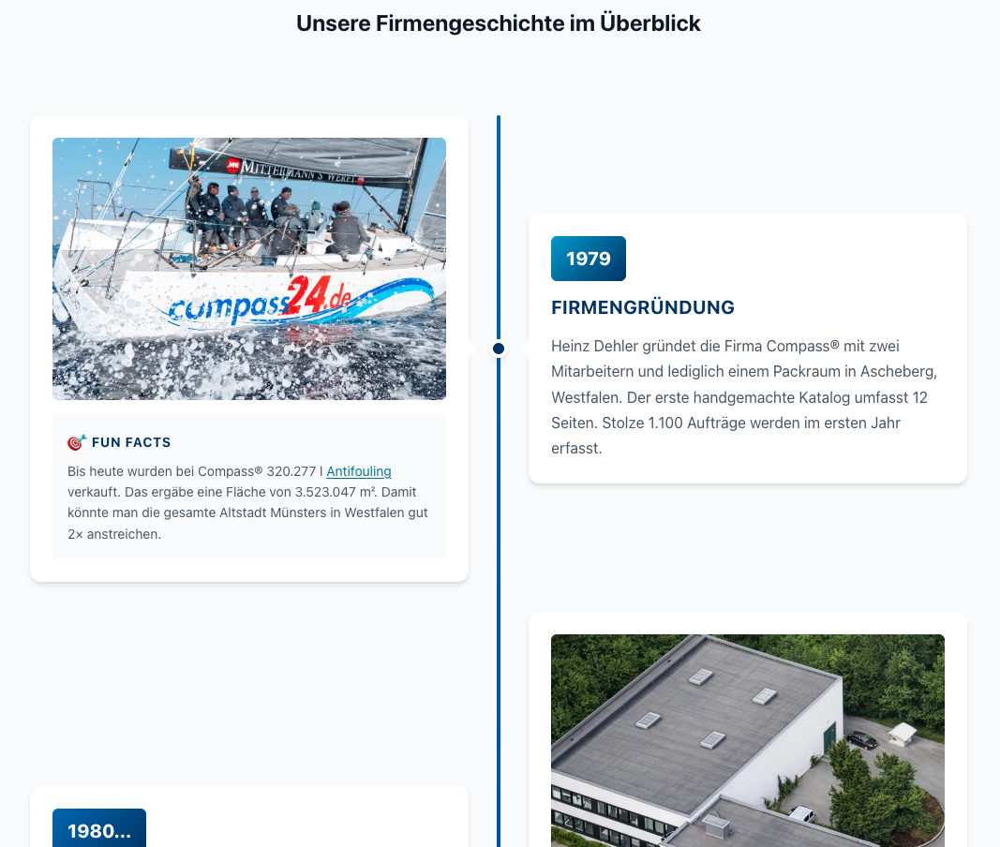
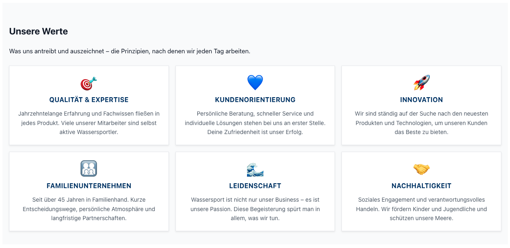

# Compass24 Landing Pages

Moderne, responsive Landing Pages für www.compass24.de mit durchdachtem Design und einer interaktiven Zeitleiste zur Unternehmensgeschichte.

## 📋 Übersicht

Dieses Projekt enthält wiederverwendbare Komponenten und Seiten für Compass24:

- **Über uns**: Unternehmensinfo mit interaktiver Zeitleiste (1995 bis heute)
- **Jobs**: Stellenangebote und Karrieremöglichkeiten
- **Landing Page Komponenten**: Modulare, wiederverwendbare Komponenten für CMS-Integration

Alle Komponenten sind für die Injection in Shopware und andere CMS-Systeme optimiert.

## ✨ Kernfeatures

- 🎨 **Modernes Design**: Sauberes, professionelles Design mit modernem CSS und HTML
- 📱 **Vollständig Responsive**: Optimiert für Mobile, Tablet und Desktop
- ♿ **Barrierefreiheit**: WCAG 2.1 AA konform mit semantischem HTML und ARIA-Labels
- 🎯 **Design System**: Umfassende Design Tokens für konsistentes Styling
- 📈 **Interaktive Timeline**: Visuelle Unternehmensgeschichte
- 🚀 **Performance**: Schnelle Ladezeiten und flüssige Animationen
- 💉 **CMS-Ready**: Einfache Injection in Shopware und andere Systeme
- 🤖 **AI-Freundlich**: GitHub Copilot Instructions für Entwicklung

## 🚀 Quick Start

1. Repository klonen:
```bash
git clone https://github.com/schafeld/compass24-landing-pages.git
cd compass24-landing-pages
```

2. Abhängigkeiten installieren:
```bash
npm install
```

3. Entwicklungsserver starten:
```bash
npm run dev
```

4. Seiten im Browser öffnen:
- `ueber-uns.html` für die Über-uns-Seite
- `jobs.html` für die Jobs-Seite

## 📁 Projektstruktur

```
compass24-landing-pages/
├── .github/
│   └── copilot-instructions.md      # GitHub Copilot Richtlinien
├── css/
│   ├── design-tokens.css            # Design System Variablen
│   ├── styles.css                   # Hauptstylesheet
│   └── components/
│       ├── accordion.css            # Akkordeon Komponente
│       └── timeline.css             # Timeline Komponente
├── js/
│   ├── main.js                      # Hauptscript
│   └── components/
│       ├── image-slider.js          # Bild-Slider
│       └── animated-counter.js      # Counter Animation
├── landing-page-components/         # Wiederverwendbare Komponenten
│   ├── company-benefits/            # Unternehmens-Benefits
│   ├── contact-card/                # Kontaktkarte
│   ├── details-accordion/           # Job-Details Akkordeon
│   ├── job-widget/                  # Interaktives Job-Widget
│   ├── location-section/            # Standort-Sektion
│   ├── stats-section/               # Schlüsselzahlen-Banner
│   ├── timeline/                    # Timeline-Variationen
│   ├── values-section/              # Unternehmens-Werte
│   ├── payment-providers/           # Zahlungsmittel-Banner
│   └── mockups/                     # Mockup-Dateien
├── scripts/
│   └── build.js                     # Build-Script
├── dist/                            # Gebaute Dateien (gitignored)
├── ueber-uns.html                   # Über-uns-Seite
├── jobs.html                        # Jobs-Seite
├── package.json                     # npm Dependencies
├── CONTRIBUTING.md                  # Contribution Guidelines
└── README.md                        # Diese Datei
```

## 🧩 Landing Page Komponenten

### 1. **Unternehmens-Benefits** `company-benefits/`



Zeigt die Vorteile, die das Arbeiten bei Compass24 bietet:
- 6 Benefit-Karten mit Icons
- Responsive Grid-Layout (1–3 Spalten)
- Animationen beim Laden
- **Verwendung:** Jobs-Seite, Karriere-Seite

📄 [Vollständige Dokumentation](landing-page-components/company-benefits/README.md)

---

### 2. **Kontaktkarte** `contact-card/`



Zeigt Kontaktinformationen für die Sekretärin:
- E-Mail und Telefonnummer
- Ansprechpartner und Adresse
- Interaktive Links (mailto, tel)
- **Verwendung:** Jobs-Seite, Footer, Kontakt-Sektion

📄 [Vollständige Dokumentation](landing-page-components/contact-card/README.md)

---

### 3. **Job-Details Akkordeon** `details-accordion/`


Detaillierte Stellenbeschreibungen in expandierbarem Format:
- Native `<details>`/`<summary>` HTML
- Keine JavaScript erforderlich
- Meta-Informationen (Standort, Typ, Startdatum)
- Call-to-Action "Jetzt bewerben"
- **Verwendung:** Wenn nur wenige Stellen (< 8) zu zeigen sind
- **Alternative:** Job Widget für viele Positionen

📄 [Vollständige Dokumentation](landing-page-components/details-accordion/README.md)

---

### 4. **Job Widget** `job-widget/`



Interaktives, filterbares Job-Angebot System:
- Petite Vue (inlined, keine externe Abhängigkeit)
- Such- und Filter-Funktionalität
- Accordion-Darstellung
- Automatische Generierung von Filter-Dropdowns
- **Verwendung:** Jobs-Seite mit vielen Positionen (> 8)
- **Hinweis:** Zwei-Block-Aufteilung erforderlich in Shopware PROD

📄 [Vollständige Dokumentation](landing-page-components/job-widget/README.md)

---

### 5. **Standort-Sektion** `location-section/`



Zeigt Unternehmensstandort mit Karte:
- Embedded Google Maps
- Text mit Feature-Liste
- Responsive Two-Column Layout
- **Verwendung:** About-Seite, Kontakt-Seite, Footer

📄 [Vollständige Dokumentation](landing-page-components/location-section/README.md)

---

### 6. **Schlüsselzahlen-Banner** `stats-section/`


Zwei Datensätze mit wichtigen Unternehmens-Statistiken:

**Datensatz 1:**
- Gründungsjahr (1979)
- Artikel (42.000+)
- Katalogseiten (400+)
- Pakete täglich (3.000+)
- Online Shops (11)

**Datensatz 2:**
- Mitarbeiter (100+)
- Lagerfläche (15.000 m²)
- Kunden (800.000+)
- Marken (150+)
- Eigenprodukte (2.000+)

- Full-Width Gradient Banner
- Responsive 5-spaltig → 1-spaltig
- **Verwendung:** About-Seite, Teaser-Section

📄 [Vollständige Dokumentation](landing-page-components/stats-section/README.md)

---

### 7. **Timeline-Sektion** `timeline/`



Interaktive Zeitleiste der Unternehmensgeschichte:
- Vertikales Layout mit Bildern und Text
- Bubble-Design für Meilensteine
- Responsive auf Mobile
- Mehrere Layouts verfügbar

**Verfügbare Variationen:**
- Nur Text-Bubbles
- Text + Bilder in Bubbles
- Fun Facts mit Bildern

- **Verwendung:** About-Seite, History-Section

📄 [Siehe Unterordner für Details](landing-page-components/timeline/)

---

### 8. **Unternehmens-Werte** `values-section/`



Zeigt die 6 Kernwerte von Compass24:
- Qualität & Expertise
- Kundenorientierung
- Innovation
- Familienunternehmen
- Leidenschaft
- Nachhaltigkeit

- Kompaktes 3×2 Grid-Layout
- Kantige Karten-Design
- Staggered Animations
- **Verwendung:** About-Seite, Culture-Section

📄 [Vollständige Dokumentation](landing-page-components/values-section/README.md)

---

### 9. **Zahlungsmittel-Banner** `payment-providers/`


Zeigt akzeptierte Zahlungsmethoden:
- Logos verschiedener Payment-Provider
- Responsive Anordnung
- **Verwendung:** Footer, Checkout-Seite

📄 [Siehe Unterordner für Details](landing-page-components/payment-providers/)

---

### 10. **Unternehmens-Leistungen** `company-benefits/` (Alternative)

Variante zur Benefits-Sektion mit anderen Inhalten:
- Detaillierte Leistungsbeschreibungen
- **Verwendung:** HR-Seite, Recruiting

---

## 🔧 NPM Scripts

| Befehl | Beschreibung |
|--------|-------------|
| `npm run dev` | Entwicklungsserver mit Hot-Reload |
| `npm run build` | Build für Produktion (→ `dist/`) |
| `npm run build:watch` | Build mit Watch-Modus |
| `npm run lint` | Alle Linter ausführen |
| `npm run lint:fix` | Linting-Fehler automatisch beheben |
| `npm run clean` | `dist/` Ordner löschen |

## 🎨 Design System

Das Projekt nutzt ein umfassendes Design Token System (`css/design-tokens.css`):

- **Farben**: Brand-Farben, semantische Farben, neutrale Palette
- **Typografie**: Font-Familie, Größen, Gewichte, Zeilenhöhe
- **Abstände**: Konsistente Spacing-Skala (4px Basis)
- **Schatten**: Elevation System für Tiefe
- **Grenzen**: Border-Radius und Border-Stile
- **Übergänge**: Timing und Dauer

### Brand-Farben (Nicht verändern!)

- **Primär**: #003366 (Compass24 Blau)
- **Sekundär**: #0066b3 (Helles Blau)
- **Akzent**: #0099cc (Cyan)

## 💉 Integration in Shopware CMS

Alle Komponenten sind für die Injection in Shopware optimiert. Jede Komponente kann unabhängig eingebunden werden:

### Schritt-für-Schritt Integration

1. **HTML-Datei öffnen** → Komponenten-Ordner
2. **CSS kopieren** → `<style>` Block aus `<head>`
3. **HTML kopieren** → Nur das `.compass24-*-component` Div
4. **In Shopware einfügen** → HTML-Editor Block
5. **Speichern**

### Best Practices

- Jede Komponente nutzt einen eindeutigen Wrapper-Class (z. B. `.compass24-job-widget-component`)
- CSS ist vollständig scoped → Keine Konflikte mit bestehenden Styles
- Alle Komponenten sind self-contained

## 🌍 Browser-Unterstützung

- Chrome (letzte 2 Versionen)
- Firefox (letzte 2 Versionen)
- Safari (letzte 2 Versionen)
- Edge (letzte 2 Versionen)
- Mobile: iOS Safari, Chrome Android

## 📱 Responsive Breakpoints

- **Mobile**: 0–479px (1 Spalte, optimiert)
- **Tablet**: 480–1023px (2–3 Spalten)
- **Desktop**: 1024px+ (volle 3+ Spalten)
- **Large Desktop**: 1440px+ (erweiterte Abstände)

## ♿ Barrierefreiheit

Das Projekt erfüllt WCAG 2.1 AA Standard:

- ✅ Semantisches HTML
- ✅ ARIA-Labels und Rollen
- ✅ Keyboard-Navigation
- ✅ Screen Reader Kompatibilität
- ✅ Farbkontrast 4.5:1 minimum
- ✅ Sichtbare Focus-Indikatoren
- ✅ Animationen respektieren `prefers-reduced-motion`

## 🤖 GitHub Copilot Integration

Das Projekt enthält umfassende Copilot-Richtlinien (`.github/copilot-instructions.md`). Bei der Verwendung von VS Code + GitHub Copilot werden automatisch befolgt:

- Coding Standards
- Design System Richtlinien
- Accessibility Requirements
- Performance Best Practices
- Brand Guidelines

## 🛠️ Entwicklung

### Anforderungen

- Moderner Web-Browser
- Text-Editor (VS Code empfohlen)
- Git für Versionskontrolle

### Änderungen durchführen

1. Feature-Branch erstellen
2. Änderungen gemäß [Contributing Guidelines](CONTRIBUTING.md)
3. Auf verschiedenen Geräten/Browsern testen
4. Pull Request einreichen

### Code-Standards

- **HTML**: Semantisches HTML5, BEM Naming
- **CSS**: Design Tokens, Mobile-First
- **JavaScript**: ES6+, const/let, JSDoc Comments
- **Accessibility**: WCAG 2.1 AA Konformität

Siehe [CONTRIBUTING.md](CONTRIBUTING.md) für Details.

## 📊 Komponenten-Übersicht Checkliste

- ✅ Company Benefits – 6 Benefit-Karten
- ✅ Contact Card – Kontaktinformationen
- ✅ Job Details Accordion – Stellenbeschreibungen (< 8)
- ✅ Job Widget – Interaktive Job-Suche (> 8)
- ✅ Location Section – Google Maps + Info
- ✅ Key Metrics – Statistiken Banner (2 Datensätze)
- ✅ Timeline – Unternehmensgeschichte
- ✅ Values Section – 6 Unternehmens-Werte
- ✅ Payment Providers – Zahlungsmittel

## 🤝 Beitragen

Wir freuen uns über Beiträge! Bitte lesen Sie zuerst unsere [Contributing Guidelines](CONTRIBUTING.md).

## 📝 Lizenz

Wo Open Source/MIT Lizenz vorliegt, ist es im Code markiert. Einige Rechte vorbehalten von Compass24®.

## 📧 Sonstiges

- **Website**, die referenziert wird: www.compass24.de (diese verlinkten Inhalte unterliegen natürlich dem Copyright)
- **GitHub**: github.com/schafeld/compass24-landing-pages
