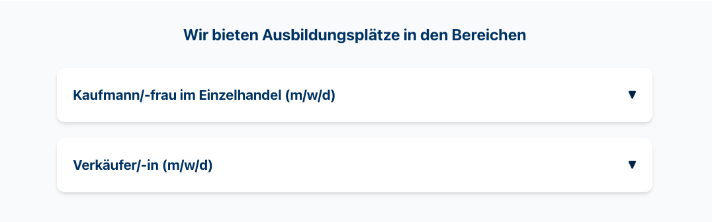

# Compass24 Job Details Accordion Komponente

## Übersicht

Die `job-details-accordion.html` ist eine responsive Akkordeon-Komponente zur Darstellung von detaillierten Stellenangeboten. Sie nutzt native HTML `<details>`/`<summary>` Elemente und benötigt kein JavaScript – perfekt für einfache, schnelle Integration in Shopware CMS.



## Funktionen

- **Responsive Design**: Passt sich automatisch an Mobile und Desktop an
- **Native HTML Akkordeons**: Nutzt `<details>/<summary>` – funktioniert überall, keine JS erforderlich
- **Moderne Animationen**: Fade-In-Up Einleitung und smooth Expand/Collapse
- **Accessibility**: WCAG 2.1 AA konform mit semantischem HTML und ARIA-Labels
- **Design Tokens**: Verwendet Bootstrap-Variablen und Fallback-Werte
- **Interaktive CTAs**: "Jetzt bewerben"-Buttons mit mailto-Links
- **Hover-Effekte**: Visuelle Feedback bei Interaktion
- **Reduzierte Bewegungen**: Respektiert User Preferences für Barrierefreiheit

## Wann sollte man diese Komponente verwenden?

### ✅ Job Details Accordion (diese Komponente)
- **Wenige Stellenanzeigen** (1–6 offene Positionen)
- **Detaillierte Job-Beschreibungen** erforderlich
- **Statische Inhalte** – keine Filter/Suche nötig
- **Einfache Integration** – kein JavaScript erforderlich
- **Spotlight auf Vertrag-Details** (Aufgaben, Anforderungen, Benefits)
- **Beispiel-Use-Case:** About-Seite mit wenigen aktuellen Stellenangeboten

### ❌ Job Widget (alternative Komponente)
- **Viele Stellenanzeigen** (10+ offene Positionen)
- **Filter & Suchfunktion** erforderlich
- **Dynamische Daten** (häufig aktualisiert)
- **Reduzierte Darstellung** der Positionen
- **Beispiel-Use-Case:** Dedizierte Jobs-Seite mit großem Angebot

**Entscheidungshilfe:** Bei weniger als 8 Stellenanzeigen ist diese Accordion-Komponente meist die bessere Wahl. Bei mehr Positionen solltest du das [Job Widget](../job-widget/) verwenden.

## Kompatibilität mit Job Widget

Beide Komponenten teilen die **gleiche visuelle Gestaltung und Animation**:
- Identische Akkordeon-Styles (Border-Radius, Schatten, Farben)
- Gleiche Job-Card-Layouts
- Identische Details-Meta-Informationen (Icons, Labels)
- Abgestimmte Hover-Effekte und Übergänge

**Wichtig:** Falls beide Komponenten auf der gleichen Seite verwendet werden, müssen die CSS-Stile aufeinander abgestimmt bleiben. Siehe Abschnitt "Synchronisierung mit Job Widget".

## Inhaltsstruktur

Jede Job-Position folgt diesem Aufbau:

```html
<details class="accordion-item">
  <summary class="accordion-trigger">
    <h3 class="accordion-trigger__title">Berufsbezeichnung (m/w/d)</h3>
    <span class="accordion-trigger__icon"></span>
  </summary>
  
  <div class="accordion-content">
    <div class="accordion-content__inner">
      <!-- Meta-Infos: Beschäftigungsart, Standort, Starttermin -->
      <div class="job-details-meta">...</div>
      
      <!-- Kurzbeschreibung -->
      <p class="accordion-content__description">...</p>
      
      <!-- Detaillierte Abschnitte: Aufgaben, Profil, Vorteile -->
      <dl class="accordion-content__list">...</dl>
      
      <!-- Bewerbungs-Button -->
      <a href="mailto:..." class="job-cta">Jetzt bewerben</a>
    </div>
  </div>
</details>
```

## Einbindung in Shopware CMS

### Schritt 1: Datei öffnen
Öffnen Sie `job-details-accordion.html` in einem Text-Editor

### Schritt 2: CSS kopieren
Kopieren Sie den kompletten `<style>` Block

### Schritt 3: HTML kopieren
Kopieren Sie nur das Markup (nicht `<html>`, `<body>`):
```html
<div class="compass24-job-accordion-component">
  <section class="accordion-section" aria-labelledby="accordion-title">
    <!-- kompletter Inhalt -->
  </section>
</div>
```

### Schritt 4: In Shopware einfügen
1. Navigieren Sie in der Shopware Verwaltung zu einer Seite oder einem CMS-Block
2. Wählen Sie einen HTML/Code-Editor Block
3. Fügen Sie zuerst den **CSS-Code** ein
4. Fügen Sie dann das **HTML-Markup** ein
5. **Speichern** Sie die Änderungen

### Alternative: Zentrale CSS-Integration
Falls Ihre Installation zentrale CSS-Dateien nutzt:

1. Fügen Sie die Styles in Ihre zentrale `styles.css` hinzu
2. Behalten Sie den `.compass24-job-accordion-component` Präfix für Scope-Isolation
3. Fügen Sie nur noch das HTML-Markup in den CMS-Block ein

## Anpassung der Inhalte

### Neue Job-Position hinzufügen

Kopieren Sie diesen Block und passen Sie die Werte an:

```html
<details class="accordion-item">
  <summary class="accordion-trigger">
    <h3 class="accordion-trigger__title">STELLENBEZEICHNUNG (m/w/d)</h3>
    <span class="accordion-trigger__icon" aria-hidden="true"></span>
  </summary>

  <div class="accordion-content">
    <div class="accordion-content__inner">
      <div class="job-details-meta">
        <div class="job-detail-item">
          <span class="job-detail-icon">⏰</span>
          <span class="job-detail-label">BESCHÄFTIGUNGSART</span>
        </div>
        <div class="job-detail-item">
          <span class="job-detail-icon">📍</span>
          <span class="job-detail-label">STANDORT</span>
        </div>
        <div class="job-detail-item">
          <span class="job-detail-icon">📅</span>
          <span class="job-detail-label">STARTTERMIN</span>
        </div>
      </div>

      <p class="accordion-content__description">
        KURZBESCHREIBUNG DER STELLE (1–3 Sätze)
      </p>

      <dl class="accordion-content__list">
        <dt>Deine Aufgaben:</dt>
        <dd>
          <ul>
            <li>AUFGABE 1</li>
            <li>AUFGABE 2</li>
            <li>AUFGABE 3</li>
          </ul>
        </dd>

        <dt>Das bringst du mit:</dt>
        <dd>
          <ul>
            <li>ANFORDERUNG 1</li>
            <li>ANFORDERUNG 2</li>
            <li>ANFORDERUNG 3</li>
          </ul>
        </dd>

        <dt>Wir bieten:</dt>
        <dd>
          <ul>
            <li>BENEFIT 1</li>
            <li>BENEFIT 2</li>
            <li>BENEFIT 3</li>
          </ul>
        </dd>
      </dl>

      <a href="mailto:sekretariat@compass24.de?subject=Bewerbung: STELLENTYP" class="job-cta">Jetzt bewerben</a>
    </div>
  </div>
</details>
```

### Meta-Informationen anpassen

Ändern Sie Beschäftigungsart, Standort und Starttermin:

```html
<div class="job-details-meta">
  <div class="job-detail-item">
    <span class="job-detail-icon">⏰</span>
    <span class="job-detail-label">Vollzeit</span>  <!-- z.B. "Teilzeit", "Ausbildungsplatz" -->
  </div>
  <div class="job-detail-item">
    <span class="job-detail-icon">📍</span>
    <span class="job-detail-label">Ascheberg</span>  <!-- Standort -->
  </div>
  <div class="job-detail-item">
    <span class="job-detail-icon">📅</span>
    <span class="job-detail-label">Ab sofort</span>  <!-- z.B. "01.03.2026" -->
  </div>
</div>
```

### Abschnitte hinzufügen/entfernen

Sie können beliebig viele `<dt>` (Überschrift) / `<dd>` (Inhalt) Paare hinzufügen:

```html
<dl class="accordion-content__list">
  <dt>Neue Sektion:</dt>
  <dd>
    <ul>
      <li>Punkt 1</li>
      <li>Punkt 2</li>
    </ul>
  </dd>
</dl>
```

### Überschrift ändern

Die Hauptüberschrift "Wir bieten Ausbildungsplätze in den Bereichen" kann angepasst werden:

```html
<h2 id="accordion-title" class="accordion-header__title">
  NEUE ÜBERSCHRIFT
</h2>
```

## Synchronisierung mit Job Widget

Falls beide Komponenten auf Ihrer Website verwendet werden, halten Sie diese Styles **identisch**:

| Style-Element | Wichtigkeit | Details |
|--------------|-------------|---------|
| `.accordion-item` Hover-Shadow | 🔴 Hoch | Sollte gleich sein: `var(--c24-shadow-lg)` |
| `.accordion-trigger` Hover-Effekt | 🔴 Hoch | Hintergrund-Farbe: `var(--c24-color-gray-50)` |
| `.accordion-trigger__icon` Animation | 🔴 Hoch | Down/Up Triangle (▼/▲) konsistent |
| `.job-cta` Button-Farben | 🟡 Mittel | Gradient und Hover-State sollten gleich sein |
| Farb-Variablen | 🟡 Mittel | Alle `--c24-color-*` sollten identisch sein |
| Border-Radius | 🟢 Niedrig | Kann leicht unterschiedlich sein |

**Best Practice:** Wenn Sie beide Komponenten zusammen verwenden, erwägen Sie die CSS-Teile in eine gemeinsame Datei (`accordion-shared.css`) auszulagern.

## Anpassung der Farben

Die Komponente nutzt CSS-Variablen für flexible Farbänderung:

```css
--c24-color-primary: #003366;           /* Hauptfarbe */
--c24-color-primary-light: #0066b3;     /* Hellere Variante */
--c24-color-primary-dark: #002244;      /* Dunklere Variante */
--c24-color-white: #ffffff;             /* Hintergrund */
--c24-color-gray-50: #f9fafb;           /* Hover-Hintergrund */
```

Passen Sie diese im `.compass24-job-accordion-component` Block an.

## Responsive Breakpoints

- **Mobile**: 0 - 767px (reduziertes Padding und Font-Größe)
- **Desktop**: 768px+ (Standard-Größe)

## Design-Details

### Akkordeon-Mechanik
- Native `<details>`/`<summary>` HTML-Elemente
- Keine JavaScript-Abhängigkeit
- Browser-native Toggle-Funktionalität
- Automatische `open`-Attribut-Verwaltung

### Icons und Symbole
- **Beschäftigungsart**: ⏰ (Uhr)
- **Standort**: 📍 (Pin)
- **Starttermin**: 📅 (Kalender)
- **Akkordeon-Indicator**: ▼ (geschlossen) / ▲ (offen)

Diese können durch SVG-Icons oder andere Symbole ersetzt werden.

### Animationen
- **Fade-In-Up**: Anfängliche Einblendung mit 0.6s Versatz
- **Expand/Collapse**: Smooth max-height Übergang via CSS
- **Hover**: Background-Farbe bei Trigger-Hover
- **Accessibility**: Alle Animationen bei `prefers-reduced-motion` deaktiviert

### CTA-Button
Der "Jetzt bewerben"-Button link:
- Nutzt `mailto:` Protokoll für E-Mail-Öffnung
- Hat `?subject=` für Pre-Filled Betreff
- Gradient-Background mit Hover-Effekt
- Fokus-Outline für Keyboard-Navigation

## Browser-Unterstützung

- Chrome (letzte 2 Versionen)
- Firefox (letzte 2 Versionen)
- Safari (letzte 2 Versionen)
- Edge (letzte 2 Versionen)
- Mobile Browser (iOS Safari, Chrome Android)

**Hinweis:** `<details>`/`<summary>` wird durch alle modernen Browser vollständig unterstützt, einige ältere Browser können fallback-Styling benötigen.

## Performance-Tipps

- Die Komponente ist eigenständig und benötigt keine externen Abhängigkeiten
- Reine HTML/CSS-Lösung – keine JavaScript erforderlich
- Schnelle Ladezeiten und hohe Lighthouse Scores
- CSS ist vollständig inline – für mehrfache Nutzung sollte es in zentrale Dateien ausgelagert werden

## Accessibility Features

- ✅ Semantisches HTML (`<section>`, `<details>`, `<summary>`, `<dl>`)
- ✅ ARIA-Labels für Struktur und Kontextualisierung
- ✅ Vollständige Keyboard-Navigation (Tab, Enter zum Öffnen/Schließen)
- ✅ Sichtbare Fokus-Indikatoren
- ✅ Farbkontrast WCAG AA konform
- ✅ Unterstützung für "prefers-reduced-motion"
- ✅ Semantische HTML-Elemente statt Divs und JavaScript-Hacks

## Versionsinformation

- **Version**: 0.2.1
- **Datum**: 2026-02-11
- **Verwendung**: Jobs/About-Seiten von Compass24
- **Abhängigkeiten**: Keine (nativer HTML)

## Notizen und Best Practices

- Diese Komponente ist als eigenständige HTML-Datei für Preview strukturiert
- Für die finale Integration in Shopware sollten gemeinsame Styles mit anderen Komponenten konsolidiert werden
- **Wichtig:** Wenn Sie diese Komponente zusammen mit dem [Job Widget](../job-widget/) verwenden, halten Sie die Akkordeon-Styling identisch, um Brand-Konsistenz zu bewahren
- Alle Text-Inhalte können ohne Auswirkung auf die Funktionalität geändert werden
- Die Komponente funktioniert auch ohne JavaScript perfekt

## Häufig gestellte Fragen

**F: Kann ich mehrere Akkordeons auf einer Seite verwenden?**  
A: Ja! Duplizieren Sie den kompletten `.compass24-job-accordion-component` Block mehrfach, oder verwenden Sie mehrere `<details>`-Blöcke innerhalb eines Containers.

**F: Wie mache ich alle Akkordeons beim Load offen?**  
A: Fügen Sie das `open` Attribut dem `<details>` Element hinzu:  
```html
<details class="accordion-item" open>
```

**F: Funktioniert das auch ohne JavaScript?**  
A: Ja! Diese Komponente nutzt native `<details>`/`<summary>` Elemente – 100% JavaScript-frei.

**F: Kann ich das "Jetzt bewerben"-Link ändern?**  
A: Ja! Ersetzen Sie `mailto:sekretariat@compass24.de?subject=...` durch eine beliebige URL oder E-Mail-Adresse:
```html
<a href="https://example.com/apply" class="job-cta">Jetzt bewerben</a>
```

**F: Die Akkordeons schauen anders aus als im Job Widget. Was ist zu tun?**  
A: Vergleichen Sie die CSS-Variablen und Styles (siehe Synchronized mit Job Widget Sektion). Kopieren Sie bei Bedarf die identischen Styles aus dem Job Widget.

**F: Kann ich die Icons (⏰, 📍, 📅) ändern?**  
A: Ja! Ersetzen Sie die Emoji einfach durch andere Unicode-Symbole oder SVG-Icons. Halten Sie `aria-hidden="true"` bei dekorativen Icons.

## Technischer Support

Bei Fragen zu CSS-Anpassungen oder Anpassungen für spezifische Anforderungen konsultieren Sie die [Copilot-Richtlinien dieses Projekts](../../.github/copilot-instructions.md).
