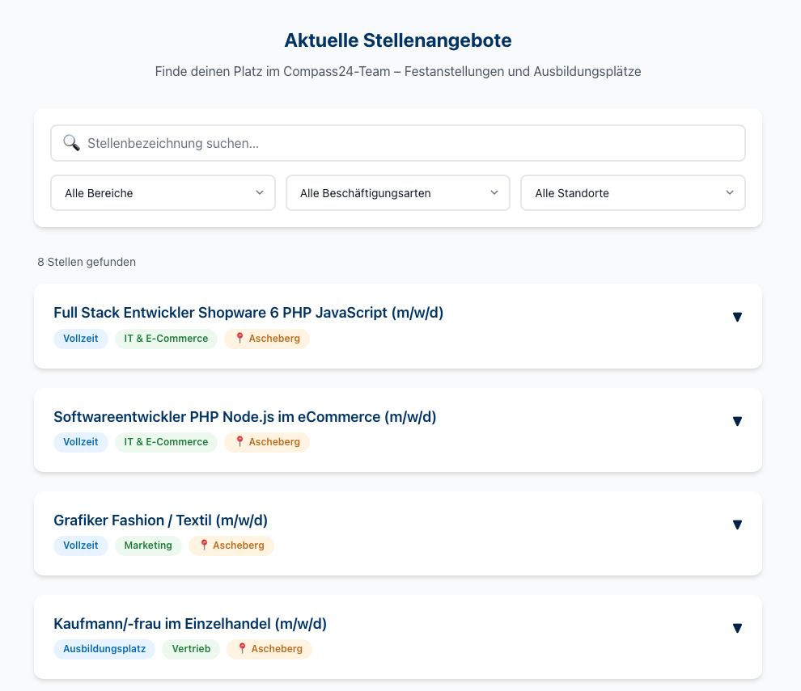

# Job Widget

## Displaying open positions with Vue.js based on Json data

See [DOKUMENTATION-job-widget-shopware](./DOKUMENTATION-job-widget-shopware.md) to learn how to edit or deploy the widget.

Initial Prompt:

Create a stand-alone, interactive presentation for Jobs ("Festanstellung") and apprenticeships ("Ausbildungsplatz") using Vue in a single file, [job-widget.html](./archive/job-widget.html). No build step but usage of a script tag using a recent LTS version of Vue. Use plain Javascript.

Take the file [job-details-accordion.html](./archive/job-details-accordion.html) as template for the presentation of a single job (fulltime or part-time) or apprenticeship. Each job or apprenticeship should get a separate accordion, stacked vertically.
The accordions should be filterable by title, kind of job ("Vertrieb", "Logistik", "Marketing", "IT & E-Commerce", "Kundenservice", "Verwaltung"),kind of employment ("Vollzeit", "Teilzeit", "Ausbildungsplatz", "Praktikum") and location ("Ascheberg", "hybrid", "remote"). You may take "Aktuelle Stellenangebote" in [compass-jobs-mockup.html](../mockups/compass-jobs-mockup.html) for inspiration of the UI, but use collapsible accordions.

The data for the Jobs Widget should come from a structured Json data object included in the HTML file. The folder [/data](./data/) dontains samples of actual job openings and titles for apprenticeships. Use Lorem ipsum text or sensible placeholders if there is no source text to fill the Json data field.

The widget should match the style of the other landing page components in this repository. Also it should have a similarly structured HTML wrapping structure, so it can be previewed stand-alone as responsive layout in a browser.

---

**Note:** The actual widget uses inline Petite Vue to save bandwidth and avoid third-party script issues.
