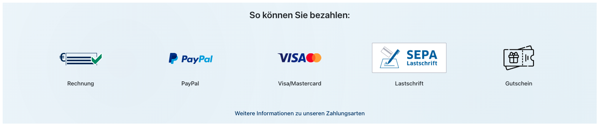

# Zahlungsarten-Banner



**Version:** 1.0.0 (16. Februar 2026)  
**Datei:** `payment-banner.html`

Der Zahlungsarten-Banner präsentiert alle akzeptierten Zahlungsmethoden von Compass24 in einer visuellen Grid-Anordnung. Eine einfache, vertrauenserweckende Komponente für Kunden.

---

## 📋 Übersicht

### Verwendungszweck

- **Checkout/Produktseite**: Zeigt akzeptierte Zahlungsmethoden
- **Footer**: Zusätzliche Trust-Signale für Kunden
- **FAQ-Seite**: Im Kontext zu Zahlungsabläufen
- **Verkaufsseiten**: Trust-Building Element

### Kernfeatures

✅ **5 Zahlungsmethoden** – Rechnung, PayPal, Visa/Mastercard, Lastschrift, Gutschein  
✅ **Responsive Layout** – Mobile (2 Spalten) → Tablet (3 Spalten) → Desktop (5 Spalten)  
✅ **Gradient Background** – Subtles, ruhiges Design  
✅ **Logo + Label** – Klare Beschriftung jeder Zahlungsart  
✅ **Info-Link** – Verweis auf vollständige Zahlungsarten-Seite  
✅ **Animationen** – FadeIn mit Staggered Delays  
✅ **Barrierefreiheit** – WCAG 2.1 AA konform  
✅ **Keine Dependencies** – Reines CSS und HTML  

---

## 🎯 Design & Layout

### Responsive Breakpoints

```
Mobile (< 480px)
├─ 2 Spalten Grid
├─ Logos: 60px
└─ Padding: kompakt

Tablet (480px–767px)
├─ 3 Spalten Grid
├─ Logos: 60px
└─ Padding: moderat

Desktop (≥ 768px)
├─ 5 Spalten Grid (eine Reihe)
├─ Logos: 80px
└─ Padding: großzügig
```

### Visuelles Design

- **Hintergrund**: Subtler Farbverlauf (blau → hellblau)
- **Pattern Overlay**: Leichte radiale Gradienten für Tiefe
- **Logos**: Max-height 60px (Mobile) / 80px (Desktop)
- **Hover-Effekt**: Leichte Anhebung (translateY -4px)
- **Animation**: FadeIn 0.6s mit 0.1s–0.5s Staggered Delays

---

## 📦 Inhalte & Assets

### Zahlungsmethoden

Die Komponente zeigt **5 akzeptierte Zahlungsarten**:

| # | Zahlungsart | Logo URL | Status |
|---|-------------|----------|--------|
| 1 | Rechnung | `https://www.compass24.de/media/d9/dc/1b/1690793872/Rechnung.png` | ✅ Verfügbar |
| 2 | PayPal | `https://www.compass24.de/media/d4/26/79/1690793872/PayPal.png` | ✅ Verfügbar |
| 3 | Visa/Mastercard | `https://www.compass24.de/media/3b/13/8d/1690793872/Visa.png` | ✅ Verfügbar |
| 4 | Lastschrift | `https://www.compass24.de/media/90/c0/f0/1750103891/lastschriftlogo-qf_rgb.png?width=1920` | ✅ Verfügbar |
| 5 | Gutschein | `https://www.compass24.de/media/51/25/02/1750106940/voucher.png?width=1920` | ✅ Verfügbar |

### Struktur eines Payment Items

```html
<div class="payment-item" role="listitem">
  <div class="payment-item__logo">
    
  </div>
  <span class="payment-item__label">Zahlungsart-Name</span>
</div>
```

**Hinweise:**
- **alt="" Attribut**: Absichtlich leer, da das Logo selbsterklärend ist
- **loading="lazy"**: Bilder werden nur geladen, wenn nötig
- **role="listitem"**: Für Accessibility (listet Zahlungsarten auf)

### Info-Link

Am unteren Ende der Komponente:
```html
<a href="https://www.compass24.de/zahlungsarten" class="payment-footer__link">
  Weitere Informationen zu unseren Zahlungsarten
</a>
```

---

## 🛠️ Shopware CMS Integration

### Schritt 1: CSS in Block 1 einfügen

1. Öffne den Shopware CMS Editor
2. Erstelle einen **CSS Block** oder nutze einen bestehenden
3. Kopiere den `<style>` Block aus der HTML-Datei
4. **Wichtig**: Nur den Inhalt zwischen `<style>` und `</style>` einfügen (nicht die Tags)

### Schritt 2: HTML in Block 2 einfügen

1. Erstelle einen **HTML Block**
2. Kopiere diesen Wrapper:
   ```html
   <div class="compass24-payment-banner-component">
     <section class="payment-section" aria-label="Akzeptierte Zahlungsarten">
       <!-- Alle payment-items und header/footer hier -->
     </section>
   </div>
   ```

### Schritt 3: Daten im CMS anpassen (Optional)

Direkt in Shopware editierbar:

**Headline ändern:**
```html
<h2 class="payment-header__title">Ihre neue Überschrift</h2>
```

**Info-Link ändern:**
```html
<a href="https://ihre-new-url.de" class="payment-footer__link">
  Neuer Link-Text
</a>
```

### Schritt 4: Speichern & Testen

- Speichern Sie beide Blöcke
- Testen Sie auf Mobile (F12 → Responsive Device Mode)
- Überprüfen Sie, dass alle Logos laden (grünes Netzwerk-Panel in DevTools)

---

## 🎨 Anpassung & Customization

### Neue Zahlungsmethode hinzufügen

Duplizieren Sie diesen Code innerhalb des `.payment-container`:

```html
<div class="payment-item" role="listitem">
  <div class="payment-item__logo">
    
  </div>
  <span class="payment-item__label">Neue Zahlungsart</span>
</div>
```

**Dann passen Sie das Grid an:**

Ändern Sie in der CSS diese Zeile:
```css
grid-template-columns: repeat(6, 1fr);  /* 6 statt 5 für 6 Items */
```

### Logo-URLs austauschen

Original-Logos können durch neue ersetzt werden:

```html
<!-- Alt: -->


<!-- Neu: -->

```

### Farben anpassen

Überschreiben Sie diese CSS-Variablen:

```css
.compass24-payment-banner-component {
  --c24-color-bg-light: #e8f2f8;      /* Hellere Gradient-Farbe */
  --c24-color-bg-lighter: #f0f7fc;    /* Hellste Gradient-Farbe */
  --c24-color-primary: #003366;       /* Primärfarbe für Link */
  --c24-color-text-dark: #212529;     /* Text-Farbe */
}
```

### Layout auf 3 Spalten ändern

Wenn Sie nur 3 Zahlungsarten zeigen möchten:

```css
grid-template-columns: repeat(3, 1fr);  /* 3 statt 5 Spalten */
```

Und entfernen Sie 2 der `<div class="payment-item">` Blöcke aus dem HTML.

### Headline-Text ändern

```html
<!-- Alt: -->
<h2 class="payment-header__title">So können Sie bezahlen:</h2>

<!-- Neu: -->
<h2 class="payment-header__title">Wir akzeptieren folgende Zahlungsmethoden:</h2>
```

### Animationen deaktivieren

Entfernen Sie vom CSS-Block diese Zeilen:

```css
.payment-item {
  animation: compass24PaymentFadeIn 0.6s ease-out both;
  animation-delay: /* ... */
}
```

Oder setzen Sie für einfacheres Editieren:
```css
animation: none !important;
```

---

## 🎬 Design-Details

### Responsive Verhalten

**Mobile (< 480px):**
- 2-spaltig Grid
- Logos: max 60px Höhe
- Padding: 1rem pro Item

**Tablet (480–767px):**
- 3-spaltig Grid
- Logos: max 60px Höhe
- Spacing: 1.5rem

**Desktop (≥ 768px):**
- 5-spaltig Grid (eine Reihe)
- Logos: max 80px Höhe
- Spacing: 2–2.5rem

### Animationen

```css
@keyframes compass24PaymentFadeIn {
  from { opacity: 0; transform: translateY(20px); }
  to { opacity: 1; transform: translateY(0); }
}
```

- **Dauer**: 0.6s
- **Timing**: ease-out
- **Staggered Delays**: 0.1s → 0.5s

Für Benutzer mit `prefers-reduced-motion: reduce` → Animationen deaktiviert

### Spacing & Größen

```css
--c24-space-4: 1rem;      /* Standard Padding */
--c24-space-6: 1.5rem;    /* Desktop Padding */
--c24-space-8: 2rem;      /* Header/Footer Margins */

Logo-Höhe: 60px (Mobile) / 80px (Desktop)
```

### Hover-Effekte

```css
.payment-item:hover {
  transform: translateY(-4px);  /* Leichte Anhebung */
  transition: 250ms ease-in-out;
}

/* Für prefers-reduced-motion: keine Transform */
```

### Hintergrund-Pattern

Der subtile Pattern besteht aus zwei radialen Gradienten:
```css
background-image: 
  radial-gradient(circle at 20% 50%, rgba(0, 51, 102, 0.03) 0%, ...),
  radial-gradient(circle at 80% 80%, rgba(0, 51, 102, 0.02) 0%, ...);
```

Dies ist optional und kann entfernt werden, wenn gar kein Pattern gewünscht ist.

---

## ❓ FAQ

### F: Kann ich mehr oder weniger Zahlungsarten zeigen?

**A:** Ja! Duplizieren Sie `<div class="payment-item">` Blöcke zum Hinzufügen oder löschen Sie sie zum Entfernen. Passen Sie dann die `grid-template-columns` an:
- 4 Items: `repeat(4, 1fr)`
- 6 Items: `repeat(6, 1fr)`

---

### F: Die Logos laden nicht / Bilder sind unscharf

**A:**
1. **Logo-URL überprüfen**: F12 → Network → Bilder-Anfragen schauen
2. **Höhere Auflösung**: Nutzen Sie größere Logo-Dateien (mind. 200×200px)
3. **Compass24 CDN**: Logos sind bei Compass24 gehostet (b-cdn.net)

---

### F: Wie ändere ich die Farben des Hintergrunds?

**A:** Ändert diese Variablen:

```css
.compass24-payment-banner-component {
  --c24-color-bg-light: #e8f2f8;      /* Hell-Blau */
  --c24-color-bg-lighter: #f0f7fc;    /* Hellst-Blau */
}
```

Oder direkt den `<section>` Style:
```css
.payment-section {
  background: linear-gradient(135deg, #ffffff 0%, #f0f0f0 100%);
}
```

---

### F: Kann ich den Info-Link ändern?

**A:** Ja, der Link ist editierbar:

```html
<a href="https://www.compass24.de/zahlungsarten" class="payment-footer__link">
  Weitere Informationen zu unseren Zahlungsarten
</a>
```

Ändern Sie die `href` URL und den Link-Text.

---

### F: Mobile zeigt die Zahlungsarten übereinander. Normal?

**A:** Ja, das ist korrekt. Mobile nutzt 2 Spalten, Tablet 3, Desktop 5. Das ist responsive Design!

Wenn Sie auf Mobile 3 Spalten möchten:
```css
@media (max-width: 767px) {
  .payment-container {
    grid-template-columns: repeat(3, 1fr);
  }
}
```

---

### F: Wie entferne ich die Animationen?

**A:** Löschen Sie diese CSS oder kommentiert sie aus:

```css
.payment-item {
  animation: compass24PaymentFadeIn 0.6s ease-out both;
  animation-delay: /* ... */;
}

@keyframes compass24PaymentFadeIn { /* */ }
```

Oder setzen Sie einfach:
```css
.payment-item {
  animation: none !important;
}
```

---

### F: Kann ich svg-Logos statt PNG nutzen?

**A:** Ja! SVGs funktionieren wie PNGs:

```html

```

SVGs sind sogar empfohlen, da sie lossless skalieren.

---

### F: Ist die Komponente DSGVO-konform?

**A:** Ja, es werden nur Zahlungs-Provider-Logos angezeigt. Keine Tracking oder externe Scripts. Der Info-Link führt zu einer Seite, die weitere Details zur Datenschutzerklärung enthalten sollte.

---

### F: Kann ich mehrere Links einfügen?

**A:** Ja, ersetzen Sie `.payment-footer` mit mehreren Links:

```html
<footer class="payment-footer">
  <a href="/zahlungsarten" class="payment-footer__link">Zahlungsarten</a>
  <span class="payment-footer__separator"> | </span>
  <a href="/agb" class="payment-footer__link">AGB</a>
</footer>
```

---

### F: Funktioniert die Komponente ohne CSS in Shopware?

**A:** Nein! Die CSS ist essentiell. Sie müssen immer beide Blöcke (CSS + HTML) einfügen.

---

## 🔗 Verwandte Komponenten

- **[Job Widget](../job-widget/README.md)** – Ähnliches Zahlungsarten-Listing (dynamisch)
- **[Stats Section](../stats-section/README.md)** – Ähnlicher Banner-Stil
- **[Location Section](../location-section/README.md)** – Weitere Info-Komponente

---

## 📖 Technische Details

| Eigenschaft | Wert |
|-------------|------|
| **HTML-Elemente** | `<section>`, `<header>`, `<footer>`, `<div>`, ``, `<a>` |
| **CSS-Scoping** | `.compass24-payment-banner-component` |
| **JavaScript** | Keine (reines CSS + HTML) |
| **Dependencies** | Keine |
| **File Size** | ~8KB (mit Inline CSS) |
| **Browser-Support** | Chrome, Firefox, Safari, Edge (letzte 2 Versionen) |
| **Accessibility** | WCAG 2.1 AA konform |
| **Mobile-First** | ✅ Ja |
| **Grid Support** | CSS Grid (`repeat(5, 1fr)`) |

---

## 📧 Sonstiges

- **GitHub**: github.com/schafeld/compass24-landing-pages
- **Zahlungsarten Info**: https://www.compass24.de/zahlungsarten

---

**Version History:**
- **v1.0.0** (16.02.2026) – Release Version
- v0.9.0 (14.02.2026) – Beta mit 5 Payment Methods

Stand: **18. Februar 2026**
